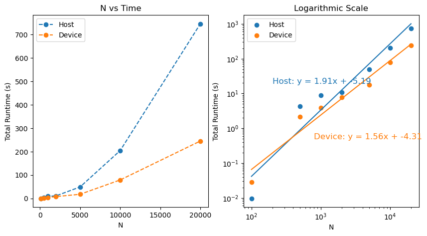
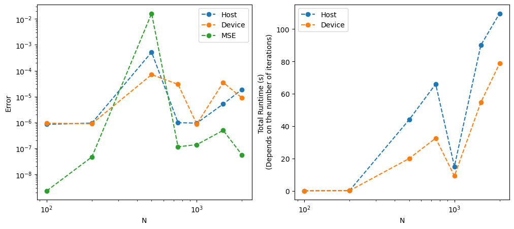
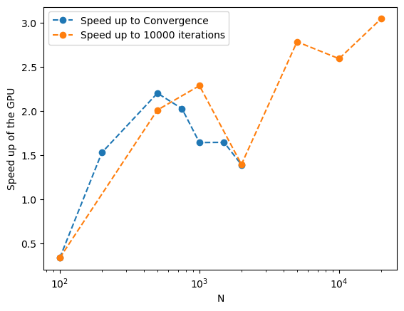

[](https://classroom.github.com/online_ide?assignment_repo_id=10939897&assignment_repo_type=AssignmentRepo)

# Conjugate Gradient Algorithm

## Introduction
The conjugate gradient method is a mathematical algorithm used to solve certain types of linear equations $\mathbf{A x} = \mathbf{b}$, specifically those with a positive-definite matrix. This method is typically used as an iterative algorithm for sparse systems that are too large to be solved directly, such as through Cholesky decomposition or other direct methods. Large sparse systems commonly occur in numerical solutions for partial differential equations or optimization problems.

The basic idea of the conjugate gradient method is to generate a sequence of mutually conjugate search directions in the solution space, which enables the method to converge to the solution in fewer iterations than other traditional iterative methods. As an iterative method, it starts with an initial geuss for $\mathbf{x} = \mathbf{x}_0$ and gets implemented as follow:

  1. Initializing the residual: $\mathbf{r} = \mathbf{b} - \mathbf{A x}$
  2. Initializing the searching direction: $\mathbf{p} = \mathbf{r}$
  3. Then while $||\mathbf{r}|| > TOL$:
      * Updating the solution: $\mathbf{x} = \mathbf{x} + \dfrac{\mathbf{r p}}{\mathbf{p A p}} \mathbf{p}$
      * Updating the residuals: $\mathbf{r} = \mathbf{b} - \mathbf{A x}$ 
      * Updating the search direction: $\mathbf{p} = \mathbf{r} - \dfrac{\mathbf{r A p}}{\mathbf{p A p}} \mathbf{p}$

The objective of this project is to implement the algorithm on a GPU, in order to take full advantage of its parallelization capabilities.

## Methods
For this project, our approach to obtaining a positive definite matrix involves first initializing the matrix $\mathbf{A}_{initial}$ randomly.

We then obtain the positive definite matrix of $\mathbf{A}$ by multiplying $\mathbf{A}_{initial}$ with its transpose, 

$$\mathbf{A} = \mathbf{A}_{initial} \mathbf{A}_{initial}^T.$$

It's worth noting that this operation is done on GPU using the [tiled method](https://penny-xu.github.io/blog/tiled-matrix-multiplication) for the sake of its memory efficiency. However, since this is not the primary objective of the project, the execution time for this kernel will not be included in our results.

In addition to matrix-matrix multiplication, which is only used at the beginning, the following kernels are required in the algorithm:
  * Element-wise multiplication addition for vectors
  * Matrix-vector multiplication
  * Dot product

The first two kernels are straightforward to implement. With only one for-loop in the serial version, in the GPU version, each thread works on a separate element and stores the results independently. To avoid memory overload, for very large matrices, some threads have to work on multiple array's elements. 

On the other hand, implementing the dot product kernel is more complex, as the threads in the GPU need to communicate with each other to return the final result.

To implement the dot product kernel, each thread in a block calculates a value of a[tid] * b[tid] and stores the result in the shared memory of the block. Once all threads have completed this operation and synchronized, a summation is performed on the shared memory of the block using a reduction algorithm such as a tree-based approach, which combines pairs of values and stores the result in the first element. With each iteration of the reduction, the number of active threads is reduced by half. Finally, each block will have a single value, which will be moved to the host to perform the final reduction and return the result of the dot product.

The number of threads per block is set to $256$ to make sure the code can be executed on most GPUs. Please note that by doing so, we are not able to utilize the maximum capacity of the newer GPUs.

To enhance the performance of the code on CPU, OpenMP has been utilized. The code is capable of running on either GPU, CPU, or both. When executing the code on both the CPU and GPU, the Mean Square Error of the two outputs is computed to ensure the independence of the final output with respect to the implementation.

The following commands are used to build the code on HPCC:
```
module purge
module load gcccuda/2020-v100
nvcc -Xcompiler -fopenmp ConjugateGradient_GPU.cu -o CG_GPU
```

The code requires three input arguments to run. The first argument specifies the size of the system N, the second argument specifies the execution device and can be set to either 'CPU', 'GPU', or 'both'. The third argument sets the number of OpenMP threads. For example, to run the code for N = 1000 on both the GPU and CPU while using 32 OpenMP threads, the command would be:
```
./CG_GPU 1000 both 32
```

## Results
As the problem size $N$ increases, there can be a significant difference in the number of iterations required for the Conjugate Gradient Algorithm to converge on the CPU and GPU implementations. For instance, when $N = 1000$, the CPU implementation converges in around 12000 iterations, while the GPU implementation takes 23000 iterations to achieve the same level of accuracy. Although we did not identify any implementation issues in the code, this difference in the number of iterations could be due to different rounding errors between the two implementations. To ensure a fair comparison between the CPU and GPU implementations, at first, we present the results for up to 10000 iterations in the next figure.



To obtain the CPU results, we ran the code on a range of OpenMP thread counts from 1 to 128, and we report the minimum execution time achieved, which occurred at either 32 or 64 threads. The figure demonstrates that, as anticipated, the GPU implementation takes longer for smaller systems due to the domination of communication time between the device and the host versus the computation time. However, as the system size grows, the GPU outperforms the CPU completely.

The log-log plot shows that the slope for the CPU implementation is approximately $1.9$, while for the GPU implementation, it is approximately $1.5$. These slopes suggest that the algorithm has super-linear complexity, indicating that the execution time grows faster than linearly with the problem size. Additionally, the super-linear effect is more pronounced in the CPU implementation than in the GPU implementation.

In the second part, we increased the maximum number of iterations to $10^5$ and allowed the Conjugate Gradient Algorithm to converge. The following plot shows the norm of the residuals for each run besides the Mean Square Error between the CPU and GPU solutions, with the algorithm terminating after a maximum of 100000 iterations (or earlier if convergence is achieved).



Based on the above figure, we can conclude that the Conjugate Gradient Algorithm performs faster on the GPU for larger system sizes, even in cases where it may take almost twice as many iterations to converge, such as for $N=1000$. Moreover, our results do not show any considerable difference in the accuracy of these two implementations.

The following figure shows the speedup of the algorithm on the GPU for both execution strategies.

<p align="center">
  
</p>

As we can observe from the figure, the speedup of up to 3 can be achieved for larger matrix sizes.

## Conclusion
This project explores the Conjugate Gradient Algorithm, an iterative method used to solve large, sparse systems of linear equations with a positive-definite matrix. The algorithm was implemented on both CPU and GPU platforms. OpenMP Parallelization was utilized to maximize the CPU capabilities, while the number of GPU threads per block was selected to ensure compatibility with most GPUs, rather than fully utilizing newer ones.

The findings indicate that the output from the two implementation methods may not always be similar. Depending on the size of the system N, one implementation may converge in considerably fewer iterations than the other. As implementation issues were not identified, the difference in iterations could be due too differences in the way that the hardware handles rounding errors.

Additionally, the results revealed that the GPU implementation was consistently faster, even in scenarios that require more iterations. For instance, a speedup of up to 1.5 was achieved for a matrix size of $N=20000$.

Overall, this project provided valuable insights into the performance differences between CPU and GPU implementations of the Conjugate Gradient Algorithm, highlighting the advantages and trade-offs of each approach and demonstrating the potential benefits of using CUDA programming for solving large sparse systems of linear equations.
