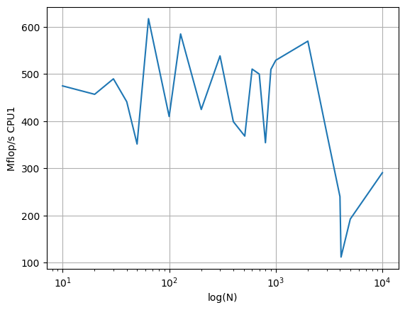
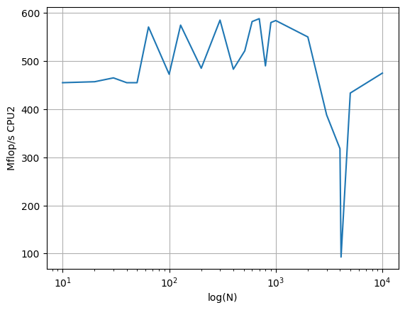
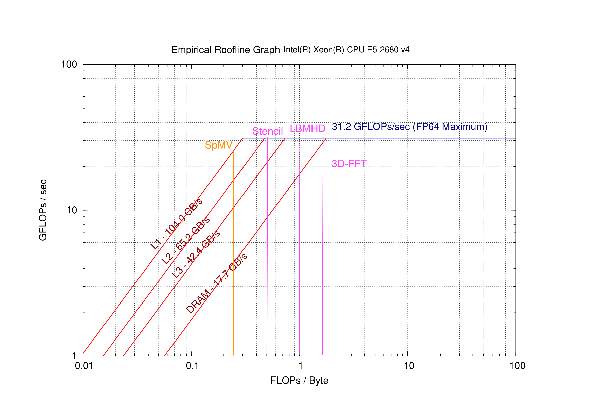
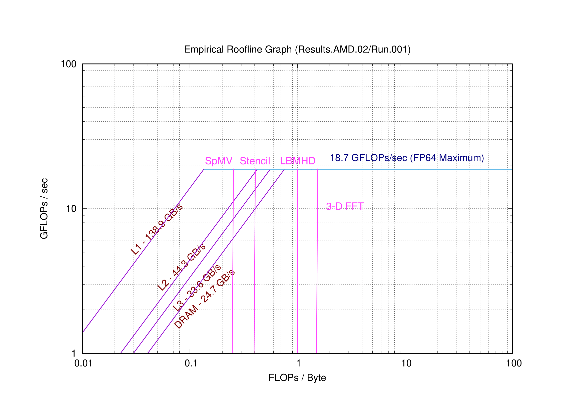

# Warm-up
The Arithmetic Intensity of the following kernels:
| Kernel                          | Arithmetic Intensity (flops/byte) |
|:-------------------------------:|:--------------------------------:|
| `Y[j] += Y[j] + A[j][i] * B[i]` | $\frac{2}{4 \times 8}$           |
| `s += A[i] * A[i]`              | $\frac{2}{1 \times 8}$           |
| `s += A[i] * B[i]`              | $\frac{2}{2 \times 8}$           |
| `Y[i] = A[i] + C*B[i]`          | $\frac{2}{3 \times 8}$           |

</br>

# Part 1
The following code is used to do matrix-matrix multiplication:
```
for (int i = 0; i < r1; i++) {
        for (int k = 0; k < c2; k++) {
            for (int j = 0; j < c1; j++) {
                answer[i][k] += Array1[i][j] * Array2[j][k];
            }
        }
    }
```
In the innermost line of the loops, there are two floating point operations. This line is executed $n^3$ times. Therefore, the total number of flop is $2N^3$.

Two nodes on HPCC have been selected for this project. The specifications of these two CPUs can be found in the following table:
| CPU                             | clock speed | L1 cache size | L2 cache size | L3 cache size | Number of cores per socket |
|:-------------------------------:|:-----------:|:-------------:|:-------------:|:-------------:|:--------------------------:|
| Intel(R) Xeon(R) CPU E5-2680 v4 | $3.30$ GHz  | $32$ KB       | $256$ KB      | $36$ MB       | 14                         |
| AMD EPYC 7H12 64-Core Processor | $2.95$ GHz  | $32$ KB       | $512$ KB      | $16$ MB       | 64                         |


</br>

The next table reports the performance of matrix-matrix multiplication for N=100:
| CPU                             | Average Performance (Mflops/s) | Standard Deviation (Mflops/s) |
|:-------------------------------:|:------------------------------:|:-----------------------------:|
| Intel(R) Xeon(R) CPU E5-2680 v4 | $410.0$                        | $25.4$                        |
| AMD EPYC 7H12 64-Core Processor | $472.5$                        | $4.3$                         |

</br>

To calculate the Peak Performance, we have:
$$\text{Theoretical peak performance (FLOPS)} = \text{Clock speed (GHz)} \times \text{Number of cores} \times \text{Number of FLOPS per clock cycle}$$

By assuming that the processor is capable of one flop per clock cycle, the theoretical peak performance for each core is equal to its clock speed.

For $N=100$, the performance is lower than the theoretical peak performance, which means that the process is memory-bounded.


</br>
</br>

#### The plot for CPU1 (Intel Xeon Processor E5-2680 v4)



>Based on the information given for CPU1(Intel(R) Xeon(R) CPU E5-2680 v4), the peak performance in the figure is lower than its theoretical value. That is due to the execution of the code on the dev nodes. 

</br>


#### The plot for CPU2 (AMD EPYC 7H12 64 Core Processor)



>Like the previous CPU, execution on the development node has caused a performance lower than the theoretical peak.


</br>
    
From the data, when the size of N exceeds 2000, the CPU computing speed tends to decline, indicating that the cache capacity is insufficient and the data needs to be called from the main memory.

NOTE: Two CPUs in N more than 4000 after the processor rate back up may be due to the processor overflowed resulting in inaccurate results.

</br>

# Part 2



</br>

The generated roofline figures for the two CPUs, IntelXeon and AMD, have shown above.

For the four kernels in our first platforms (InterlXeon), SpMV met the bandwidth bound and other three met the computer bound.

In our second platforms (AMD), all four of them met the coumputer bound.

For bandwidth bound the optimization strategy are：
1. Use loop unrolling and loop fusion to reduce the total number of operations and improve the data locality.
2. Utilize compiler optimizations such as vectorization and prefetching instructions to increase the data throughput.
3. Use better caching strategies to reduce data access latency and improve the overall performance.
4. Increase the utilization of the bandwidth by employing advanced data packing techniques.
5. Optimize memory accesses by using multiple threads to access different parts of the data concurrently.

For computer bound the optimization strategy might be change the CPU or other hardware to improve the performance.

The Arithmetic Intensity of the four give kernels are between $0.125$ to $0.25$ flops/byte. Therefore, based on our figures, it can be concluded that on AMD, they are computer bounded while on the Intel they tend to be memory bounded.

Finally, comparison of part 1 and part 2 shows that the implemented matrix-matrix multipication is not optimized. By using vector operation of CPUs, the performance in part 1 can be maximized and become closer to what we are seeing in roofline plots. In addition, submitting the jobs on the nodes, instead of using the dev nodes, may lead to further improvement.
